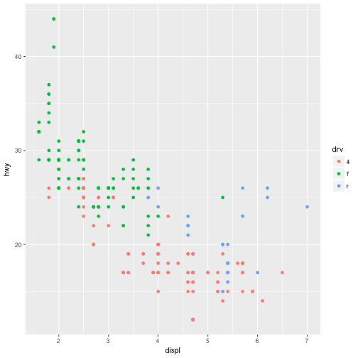

## HTML5 ppresentations 

### Using slidify with Rmarkdown
<br><br>
##### Vannia Gonzalez

---


## Slidify 

 1. Presentations from Markdown (for R)
 
 2. Write your slides in RMarkdown, a format that combines the core syntax of Markdown with embedded code chunks that are executed.

 3. Turn your slides into a stunning HTML5 presentation using any of the more than ten slide generation frameworks supported.
 
 4. Add slide classes and css to customize your presentation. Use layouts to achieve more complex designs.
 
 5. Share your presentation on Github or Dropbox (or Rpubs) in minutes. Slidify has it all covered from creation to publication.
 
 6. Useful to know as a preamble to shiny

---bs:soothe &vertical

## Getting started

***

## Install

> 1. Some knowledge of R
> 2. Rstudio is very helpful! (R professional software) 
> 3. Code chunks compatible with many languages
> 4. Git installed in your OS
> 5. Install slidify and slidify libraries from github


```r
install.packages('devtools')
install.packages_github('slidify','ramnathv')
install.packages('slidifyLibraries')
```

***

## Initialize (start a demo)


```r
library('slidify')
author('firstdemo')
```

> 1. The former creates the directory /firstdemo (in your workspace) and switches to that directory opening a file named 'index.html' with a sample template to write over

> 2. An empty git repository is also initialized and opens a deck ('presentation')

>3. The .Rmd file is the only one you need to work with and where you will actually modify the deck (your presentation). 

***
>1. The sample deck looks like this (the first lines are the YAML front matter):


```r
---
title       : 
subtitle    : 
author      : 
job         : 
framework   : io2012        # {io2012, html5slides, shower, dzslides, ...}
highlighter : highlight.js  # {highlight.js, prettify, highlight}
hitheme     : tomorrow      # 
widgets     : []            # {mathjax, quiz, bootstrap}
mode        : selfcontained # {standalone, draft}
knit        : slidify::knit2slides
---

## Read-And-Delete

1. Edit YAML front matter
2. Write using R Markdown
3. Use an empty line followed by three dashes to separate slides!
--- 

## Slide 2
```
***

>1. Or like this (for this presentation):


```r
---
title: "Cool html5 presentations using slidify and ramnathv.js"
author: "Vannia Gonzalez"
github:
  repo: toolstuts
  user: vanniagm
hitheme: zenburn
job: Insight Fellows 2017
mode: selfcontained
revealjs:
  theme: sky
  transition: slide
subtitle: Insight useful tools
framework: revealjs
url:
  lib: .
widgets: mathjax
---
```


---bs:soothe &vertical
## Generate


>1. Generate your presentation by running slidify. This will create a static HTML5 presentation that you can open locally in your browser.

```r,evaluate=FALSE
slidify('index.Rmd')

```
***

## Publish


```r
# publish to github
# create an empty repo on github. replace USER and REPO with your repo details
publish(user = USER, repo = REPO) 
```

***

## Customize

>1. Write your presentation in RMarkdown, using a newline followed by three dashes to separate slides. You can mix markdown with code chunks to create a reproducible slide deck. Look at this [cheatsheet](https://www.rstudio.com/wp-content/uploads/2015/02/rmarkdown-cheatsheet.pdf)

```
#---
#1st slide
#---
#2nd slide
# --- .class #id

#---ds:soothe &vertical
#1st slide
#***
#2nd embedded vertical 
# --- .class #id

#--- ds:alert
### This is an alert page
# --- .class #id

```

***

> 2. Slidify is designed to be MODULAR and provides a high degree of customization or you can access the defaults using slidifyDefaults(). It is possible to override options by passing it to slidify as a named list or as a 'yaml' file (the initial settings at the beginning of the deck) .

> 3. Widgets include useful tools to: 
        - make quizzes
        - use math formulas and
        - utilize the bootstrap framework


--- 


## R code

>1. You can insert code  as \`\`\`{r}  code here  \`\`\`  


```r
library(ggplot2)
qplot(displ, hwy, data = mpg,col=drv)
```




---bs:soothe &vertical

## HTML widgets

---

## HTML widget library

HTML widgets are interactive graphics made for the web. These are the main libraries available:

- [leaflet](https://rstudio.github.io/leaflet/): interactive maps
- [dygraphs](https://rstudio.github.io/dygraphs/): charting time series data
- [metricsgraphics](http://www.htmlwidgets.org/showcase_metricsgraphics.html): scatterplots, linegraphs and histograms
- [networkD3](http://christophergandrud.github.io/networkD3/): network graphs
- [DT](https://rstudio.github.io/DT/): print dataframes as html
- [threejs](http://www.htmlwidgets.org/showcase_threejs.html): 3d scatterplots and [globes](https://www.chromeexperiments.com/globe)
- [DiagrammeR](http://rich-iannone.github.io/DiagrammeR/): pretty diagrams


---

## leaflet


<iframe src="leaflet1.html" width=100% height=100% allowtransparency="true"> </iframe>

---
If push(user,repo) does not work

>1. Create repo with same name as author('name')
>2. Initialize git in workspace (from terminal)
>3. Add label, commit and push

```sh
>git init
>git remote addd origin <github-repo-url>
>git add .
>git commit -m 'description of changes'
>git push origin master
```
>4. Important! In your github repo (remote), go to settings and enable github-pages
